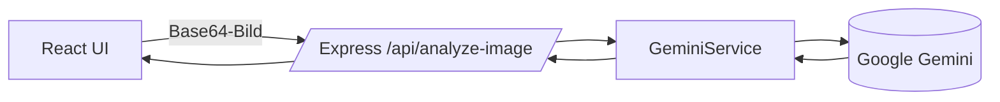

# Müllmer

Eine schlanke Full‑Stack‑App, die ein Bild aufnimmt oder importiert und es mit dem Google‑Gemini‑Modell analysiert. Ergebnis ist ein striktes JSON zur Mülltrennung in Deutschland.

[Read in English](README.md)

## Architektur

- **Frontend (Vite + React)** in `src/`
- **Backend (Express)** in `server/`
- **AI‑Service (Gemini)** in `server/services/genaiService.js`
- **Route** `POST /api/analyze-image` in `server/routes/analyze.js`
- **Statische Assets** in `public/`



## Backend

- `server/index.js`: Express-App, CORS, JSON‑Body (50mb), Health‑Check, statisches Serving in Production.
- `server/routes/analyze.js`: Validiert `imageData` (Base64‑Data‑URL), delegiert an Service, gibt JSON zurück.
- `server/services/genaiService.js`: Kapselt das Google‑GenAI‑SDK mit fester System‑Anweisung und JSON‑Schema.
  - WICHTIG: Der System‑Prompt darf nicht verändert werden.

## Frontend

- `src/Home.jsx`: Verknüpft Kamera, Aktionen und Ergebnis‑Modal.
- `src/hooks/useCamera.js`: Verwalten von `MediaStream` und Kamerawechsel.
- `src/hooks/useImageCapture.js`: Nimmt/Importiert Bild und ruft das Backend auf.
- `src/components/*`: UI‑Bausteine wie Header, Kamera‑Vorschau und Action‑Buttons.

## Umgebungsvariablen
Erstelle eine `.env` im Projekt‑Root (auch für das Backend):

```env
GEMINI_API_KEY=dein_api_key
# Optional
GEMINI_MODEL=gemini-2.5-flash
PORT=3001
NODE_ENV=development
```

Hinweise:
- Das Frontend (Vite) liest nur `VITE_*` bzw. `PUBLIC_*`. Der Gemini‑Schlüssel bleibt serverseitig.

## Entwicklung

- Installieren: `npm i`
- Frontend starten: `npm run dev` (Standardport 1420)
- Backend starten: `npm run server` (Standardport 3001)
- Beides starten: `npm run dev:full`

## Build

- Frontend: `npm run build` → Ausgabe in `dist/`
- Produktionsserver: `npm start` (liefert `dist/` aus, wenn `NODE_ENV=production`)

## Deployment

- **Ein einzelner Server (einfache Empfehlung):**
  - Lokal oder in CI bauen: `npm run build`
  - `.env` mit `GEMINI_API_KEY` auf dem Server hinterlegen.
  - Start: `NODE_ENV=production PORT=3001 node server/index.js`
  - `dist/` wird durch Express ausgeliefert.
- **Statisches Hosting + API:**
  - `dist/` bei Netlify/Vercel hosten.
  - `server/` bei Render/Railway/Fly mit derselben `.env` deployen.
  - Frontend auf die bereitgestellte `/api/analyze-image`‑URL konfigurieren.

### Docker

- Build & Run mit Compose:

```bash
docker compose up --build -d
# App: http://localhost:${PORT:-3001}
```

- Build & Run mit Docker (ohne Compose):

```bash
docker build -t muellmer:latest .
docker run -d \
  --name muellmer \
  -p ${PORT:-3001}:3001 \
  --env-file ./.env \
  muellmer:latest
```

- Umgebung:
  - Secrets in `.env` (nicht eingecheckt). Erforderlich: `GEMINI_API_KEY`.
  - `PORT` steuert den Host‑Port im Compose‑Mapping (Container hört immer auf `3001`).
  - `NODE_ENV=production` ist im Container standardmäßig gesetzt.

## API

- `POST /api/analyze-image`
  - Body: `{ imageData: "data:image/png;base64,..." }`
  - Response: `{ success: true, data: { names: [], materials: [], material_colors: [], description: "..." } }`

## Sicherheit

- `GEMINI_API_KEY` ausschließlich serverseitig speichern.
- Eingabegröße/-typ validieren; aktuelles Limit: `50mb`.

## Ordnerstruktur
```text
server/
  index.js
  routes/
    analyze.js
  services/
    genaiService.js
src/
  App.jsx
  Home.jsx
  components/
  hooks/
  constants/
public/
```

