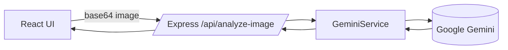

# Müllmer

A minimal full‑stack app that captures or imports an image and analyzes it with Google's Gemini model to produce a strict JSON result describing waste separation in Germany.

## Architecture

- **Frontend (Vite + React)** in `src/`
- **Backend (Express)** in `server/`
- **AI Service (Gemini)** in `server/services/genaiService.js`
- **Route** `POST /api/analyze-image` in `server/routes/analyze.js`
- **Static assets** in `public/`



## Backend

- `server/index.js`: Express app, CORS, JSON body (50mb), health check, static serving in production.
- `server/routes/analyze.js`: Validates `imageData` (Base64 Data URL), delegates to service, returns JSON.
- `server/services/genaiService.js`: Wraps Google GenAI SDK with a fixed system instruction and JSON schema.
  - IMPORTANT: The system prompt must not be changed.

## Frontend

- `src/Home.jsx`: Wires camera, actions, and result modal.
- `src/hooks/useCamera.js`: Manages `MediaStream` and camera switching.
- `src/hooks/useImageCapture.js`: Captures/imports image and calls backend.
- `src/components/*`: UI pieces like header, camera preview, and action buttons.

## Environment
Create a `.env` in project root (also used by backend):

```env
GEMINI_API_KEY=your_api_key
# Optional
GEMINI_MODEL=gemini-2.5-flash
PORT=3001
NODE_ENV=development
```

Notes:
- Frontend uses Vite and reads only `VITE_*` or `PUBLIC_*` envs. Gemini keys stay on server.

## Development

- Install: `npm i`
- Run frontend: `npm run dev` (default port 1420)
- Run backend: `npm run server` (default port 3001)
- Run both: `npm run dev:full`

## Build

- Frontend: `npm run build` → outputs `dist/`
- Production server: `npm start` (serves `dist/` when `NODE_ENV=production`)

## Deployment

- **Single server (recommended simple setup):**
  - Build locally or in CI: `npm run build`
  - Ensure `.env` has `GEMINI_API_KEY` on the server.
  - Start: `NODE_ENV=production PORT=3001 node server/index.js`
  - Serve `dist/` via Express as configured.
- **Static hosting + API:**
  - Host `dist/` on Netlify/Vercel.
  - Deploy `server/` to Render/Railway/Fly with the same `.env`.
  - Frontend should call the deployed `/api/analyze-image` URL.

## API

- `POST /api/analyze-image`
  - Body: `{ imageData: "data:image/png;base64,..." }`
  - Response: `{ success: true, data: { names: [], materials: [], material_colors: [], description: "..." } }`

## Security

- Keep `GEMINI_API_KEY` server-side only.
- Validate input size/type; current limit is `50mb`.

## Folder Structure

```text
server/
  index.js
  routes/
    analyze.js
  services/
    genaiService.js
src/
  App.jsx
  Home.jsx
  components/
  hooks/
  constants/
public/
```
